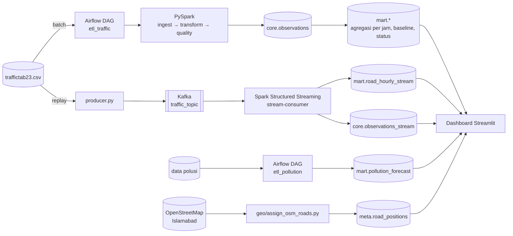

# MetropoliaCity — Analisis Big Data Lalu Lintas & Polusi Islamabad

Proyek mata kuliah Analisis Big Data. Data lalu lintas **traffictab23** (Islamabad–Rawalpindi, 2022–2023)
dan data polusi udara Islamabad diolah menjadi **dashboard untuk analis pemerintah dan petugas lapangan**:
peta jalan yang berwarna sesuai kepadatan, daftar insiden beserta pihak yang harus dihubungi, tren,
prakiraan PM2.5, dan pemantauan kualitas data.

Pipeline berjalan dalam dua mode:

- **Batch**: Airflow menjalankan PySpark untuk memuat seluruh dataset dua tahun ke PostgreSQL.
- **Streaming (real-time)**: dataset yang sama diputar ulang lewat Kafka. Spark Structured Streaming
  mengolahnya per micro-batch, dan dashboard ikut bergerak tanpa perlu di-refresh.

---

## Daftar isi

1. [Gambaran arsitektur](#1-gambaran-arsitektur)
2. [Teknologi](#2-teknologi)
3. [Struktur repositori](#3-struktur-repositori)
4. [Menjalankan proyek dari nol](#4-menjalankan-proyek-dari-nol)
5. [Demo streaming (satu perintah)](#5-demo-streaming-satu-perintah)
6. [Halaman dashboard](#6-halaman-dashboard)
7. [Model data (tabel PostgreSQL)](#7-model-data-tabel-postgresql)
8. [Cara kerja pipeline](#8-cara-kerja-pipeline)
9. [Keputusan desain penting](#9-keputusan-desain-penting)
10. [Keterbatasan data](#10-keterbatasan-data)
11. [Troubleshooting](#11-troubleshooting)
12. [Alur kerja Git](#12-alur-kerja-git)

---

## 1. Gambaran arsitektur



Satu aturan utama: **dashboard hanya membaca** tabel yang sudah jadi. Semua perhitungan berat dikerjakan
oleh pipeline (Airflow/Spark), jadi dashboard tetap ringan.

---

## 2. Teknologi

| Komponen | Teknologi | Fungsi |
|---|---|---|
| Orkestrasi batch | Apache Airflow (LocalExecutor) | Menjalankan DAG `etl_traffic` dan `etl_pollution` |
| Pengolahan data | PySpark 3.5 (local mode) | ETL batch dan Structured Streaming |
| Message broker | Apache Kafka (KRaft, tanpa Zookeeper) | Menyimpan aliran event `traffic_topic` |
| Database | PostgreSQL 16 | Skema `core` (data bersih), `mart` (agregasi), `meta` (kualitas, geometri jalan) |
| Dashboard | Streamlit + Folium + Altair | Peta, grafik, tabel, auto-refresh |
| Peta jalan | OpenStreetMap (Overpass API) | Geometri jalan nyata Islamabad |
| Model polusi | scikit-learn (RandomForest) | Prakiraan PM2.5 satu jam ke depan |
| Infrastruktur | Docker Compose | Semua service dalam satu perintah |

**Port yang dipakai di komputer host:**

| Service | Port | Catatan |
|---|---|---|
| PostgreSQL | **5433** | Bukan 5432, agar tidak bentrok dengan PostgreSQL yang terpasang langsung di Windows |
| Airflow UI | 8080 | Login memakai `AIRFLOW_ADMIN_USER` / `AIRFLOW_ADMIN_PASSWORD` dari `.env` |
| Kafka | 9092 (antar-container), 9093 (dari host) | |
| Dashboard | 8501 | Default Streamlit |

---

## 3. Struktur repositori

```
airflow/dags/            DAG Airflow (etl_traffic, etl_pollution)
spark/
  common/                schema, Spark session (zona waktu dikunci), helper Postgres
  jobs/
    ingest.py            CSV → Parquet
    transform.py         Parquet → core.observations (pembersihan + kolom turunan)
    quality_checks.py    pengecekan kualitas → meta.quality_results
    stream_transform.py  Kafka → core.observations_stream + mart.road_hourly_stream
  tests/                 unit test pytest (tanpa Postgres)
streaming/
  producer.py            replay CSV ke Kafka (mode interval tetap atau burst acak)
  Dockerfile
pollution/               pipeline polusi + quality check polusi
ml/                      pelatihan model prakiraan PM2.5
geo/
  assign_osm_roads.py    memetakan road_segment_id ke jalan nyata Islamabad (OSM)
sql/schemas/             DDL PostgreSQL, dijalankan otomatis saat volume Postgres pertama kali dibuat
dashboard/
  app.py                 titik masuk + navigasi
  db.py                  semua query dashboard (dengan cache)
  theme.py               warna, ambang status, format angka/tanggal
  style.css
  views/                 satu file per halaman (peta, insiden, streaming, tren, polusi, kualitas)
config/
  incident_types.yaml    kode insiden → nama → pihak yang dihubungi
  thresholds.yaml
docs/                    keterbatasan data, catatan demo
docker/airflow/          Dockerfile Airflow + Java + PySpark + driver JDBC
.streamlit/config.toml   tema dashboard
docker-compose.yml
demo.ps1                 demo streaming satu perintah (Windows PowerShell)
requirements-dashboard.txt
requirements-dev.txt
```

**Yang sengaja tidak masuk Git** (lihat `.gitignore`): `.env`, `data/raw/`, `data/parquet/`,
`data/checkpoints/`, `data/models/` (file model berukuran 178 MB, melebihi batas GitHub), serta log.

---

## 4. Menjalankan proyek dari nol

### Prasyarat

- Docker Desktop (Windows: backend WSL2). Proyek ini diuji pada alokasi memori WSL sekitar **3,7 GB**.
  Tambah memorinya jika bisa.
- Python 3.11+ di host, untuk menjalankan dashboard.
- Dataset `traffictab23.csv` (dari Kaggle) dan data polusi (lihat `data/README.md`).

### Langkah

```powershell
# 1. Konfigurasi
copy .env.example .env
#    lalu isi password di .env

# 2. Letakkan dataset
#    data\raw\traffictab23.csv

# 3. Nyalakan semua service
docker compose up -d --build
```

`docker compose up -d` menyalakan Postgres, Kafka, Airflow, dan **stream-consumer**, yaitu streaming
job yang langsung menunggu data. Producer **tidak** ikut menyala karena hanya dijalankan saat demo.

```powershell
# 4. Jalankan pipeline batch (sekali saja, butuh beberapa menit)
docker compose exec airflow-scheduler airflow dags trigger etl_traffic
docker compose exec airflow-scheduler airflow dags trigger etl_pollution
#    pantau progresnya di http://localhost:8080

# 5. Petakan segmen jalan ke peta Islamabad (sekali saja)
#    lihat docstring di geo/assign_osm_roads.py

# 6. Jalankan dashboard di host
python -m venv .venv
.venv\Scripts\activate
pip install -r requirements-dashboard.txt
streamlit run dashboard/app.py
#    buka http://localhost:8501
```

> Jangan menjalankan DAG batch bersamaan dengan demo streaming. Dengan memori ~3,7 GB, keduanya
> berebut RAM dan salah satu bisa dimatikan sistem (OOM).

---

## 5. Demo streaming (satu perintah)

Semua kebutuhan demo ditangani oleh `demo.ps1`. Data yang sudah ada **tidak dihapus**, dan replay
**melanjutkan** tepat setelah event terakhir yang tersimpan.

| Perintah | Fungsi |
|---|---|
| `.\demo.ps1 -Check` | Pemeriksaan pra-demo (Kafka, Postgres, streaming job, sisa dataset, memori). Masalah yang bisa diperbaiki otomatis langsung diperbaiki. |
| `.\demo.ps1 -Limit 1000 -BurstMax 50` | Kirim 1000 event, 1–50 event acak per detik |
| `.\demo.ps1` | Kirim 600 event, 1 event per detik |
| `.\demo.ps1 -Reset` | Kosongkan tabel streaming + checkpoint, lalu mulai lagi dari awal 2022 (tabel batch tidak disentuh) |
| `.\demo.ps1 -Stop` | Hentikan streaming job |

Jika Windows memblokir skrip, jalankan dengan `powershell -ExecutionPolicy Bypass -File .\demo.ps1 -Check`.

**Urutan saat presentasi:**

```powershell
docker compose up -d
.\demo.ps1 -Check                      # tunggu sampai muncul "Siap demo"
streamlit run dashboard/app.py         # di terminal lain
.\demo.ps1 -Limit 1000 -BurstMax 50    # ulangi untuk menambah data
```

Di dashboard, buka **Streaming langsung** lalu pilih **Live** di halaman **Peta** dan **Insiden**.
Status berubah menjadi "Mengalir" sekitar 10–20 detik setelah producer mulai mengirim.

**Mengapa demo ini tahan gangguan:**

- Streaming job hanya berjalan di container `stream-consumer` dengan `restart: unless-stopped`.
  Jika job mati (kehabisan memori, error, laptop tertidur), Docker menyalakannya lagi dan job
  melanjutkan dari checkpoint.
- Hanya ada satu container untuk job ini, jadi tidak mungkin ada dua job yang berjalan bersamaan.
- Sink-nya idempoten, sehingga event yang terkirim dua kali tetap tersimpan satu kali (lihat [bagian 9](#9-keputusan-desain-penting)).

---

## 6. Halaman dashboard

| Grup | Halaman | Isi | Sumber data |
|---|---|---|---|
| Operasional | **Peta lalu lintas** | Setiap segmen digambar sepanjang jalan aslinya di Islamabad, diwarnai menurut kepadatan (merah/oranye/biru). Ikon insiden diletakkan di titik tengah jalan. Klik jalan untuk melihat detail. Bisa dipilih Live atau Historis. | `mart.road_current_status(_live)`, `meta.road_positions` |
| Operasional | **Insiden** | Insiden per jenis, segmen dengan insiden terbanyak, tren, dan 30 insiden terbaru beserta kontak penanganannya | `core.observations(_stream)` |
| Operasional | **Streaming langsung** | Status aliran (Mengalir/Melambat/Berhenti), event per menit, event terbaru, dan bukti bahwa hasil streaming identik dengan hasil batch | `core.observations_stream` |
| Analisis | **Tren kepadatan** | Heatmap hari × jam, profil harian, ringkasan per shift | `mart.road_hourly_stats`, `mart.shift_summary` |
| Lingkungan | **Polusi udara** | PM2.5 aktual vs prakiraan, kategori AQI, dan akurasi model (MAE pada data uji) | `mart.pollution_forecast` |
| Sistem | **Kualitas data** | Hasil quality check setiap run pipeline, dinilai otomatis (Lolos/Gagal/Temuan/Info), plus pengecekan langsung atas tabel streaming | `meta.quality_results` |

Halaman dengan data live memperbarui diri sendiri (`st.fragment(run_every=…)`). Yang dimuat ulang
hanya bagian datanya, bukan seluruh halaman.

**Status kepadatan** (`dashboard/theme.py`), berdasarkan `jam_density_index`:

| Status | Ambang | Warna |
|---|---|---|
| Kepadatan tinggi | ≥ 75 | merah |
| Kepadatan sedang | 50–74,9 | oranye |
| Kepadatan rendah | < 50 | biru |

**Level peringatan segmen** (`alert_level`, dihitung di view SQL):

| Level | Kondisi |
|---|---|
| kritis | Ada *Major accident* (2) atau *Road blockage* (4) dalam jam tersebut |
| waspada | Tingkat anomali ≥ 2 simpangan baku di atas baseline jam-dalam-minggu segmen itu |
| perhatian | Cuaca buruk atau permukaan jalan basah |
| normal | Selain kondisi di atas |

**Jenis insiden** (`config/incident_types.yaml`):

| Kode | Jenis | Pihak yang dihubungi |
|---|---|---|
| 1 | Minor collision | Patroli / penanganan administratif |
| 2 | Major accident | Ambulans dan polisi |
| 3 | Signal disruption | Teknisi V2X / sinyal |
| 4 | Road blockage | Tim derek / pembersihan |

---

## 7. Model data (tabel PostgreSQL)

| Tabel / view | Isi | Diisi oleh |
|---|---|---|
| `core.observations` | Seluruh observasi lalu lintas yang sudah dibersihkan (2022–2023) | DAG `etl_traffic` |
| `core.observations_stream` | Observasi yang masuk lewat streaming, ditambah kolom `ingested_at` (waktu tiba di DB) | `stream-consumer` |
| `mart.road_hourly_stats` | Agregasi per segmen per jam (rata-rata kecepatan, kepadatan, jumlah insiden, dll.) | pipeline batch |
| `mart.road_hourly_stream` | Struktur dan rumus sama dengan tabel di atas, tetapi diisi real-time (upsert) | `stream-consumer` |
| `mart.road_window_stats` | Agregasi per jendela 15 menit | pipeline batch |
| `mart.hour_of_week_baseline` | Rata-rata dan simpangan baku per segmen × hari × jam, sebagai dasar status `waspada` | pipeline batch |
| `mart.road_current_status` / `_live` | **View**: status terkini tiap segmen (`alert_level`, `v2x_status`) | turunan dari dua tabel per jam di atas |
| `mart.shift_summary` | Ringkasan insiden dan anomali per shift kerja | pipeline batch |
| `mart.pollution_forecast` | PM2.5 aktual vs prakiraan per jam, per versi model | DAG `etl_pollution` |
| `meta.quality_results` | Hasil setiap quality check per run | DAG batch |
| `meta.road_positions` | Nama jalan, jenis jalan, panjang, geometri (`path`), dan titik tengah tiap segmen | `geo/assign_osm_roads.py` |

Kolom waktu: `observed_at` adalah **waktu event**, yaitu timestamp asli di dataset (zona Asia/Karachi).
`ingested_at` adalah **waktu proses**, yaitu saat baris masuk ke Postgres. Halaman Streaming memakai
`ingested_at` untuk menilai apakah data sedang mengalir, dan memakai `observed_at` untuk isi analisisnya.

---

## 8. Cara kerja pipeline

### Batch: `etl_traffic`

```
ingest (CSV → Parquet)  →  transform_load (Parquet → core.observations)  →  quality_checks (→ meta.quality_results)
```

- **Transform**: tipe data diperbaiki, nilai di luar rentang ditandai, dan kolom turunan dibuat
  (`obs_date`, `obs_hour`, `window_15min`, nama insiden). Jam dihitung ulang dari `observed_at`
  karena kolom `time_of_day` di data mentah tidak konsisten.
- **Quality check**: jumlah baris, baris dobel, nilai di luar rentang, dan kecocokan
  `anomaly_label` dengan `incident_type`. Hasilnya tampil di halaman Kualitas data.

### Streaming: `stream_transform.py`

```
producer.py ──► Kafka traffic_topic ──► Spark (micro-batch tiap 10 detik)
                                          ├─ query 1: transformasi sama dengan batch → core.observations_stream
                                          └─ query 2: agregasi per jam (stateful)   → mart.road_hourly_stream
```

- **Query 1** memakai fungsi transformasi yang sama dengan pipeline batch. Kartu "Sama dengan batch"
  di dashboard membuktikan hasilnya identik baris demi baris.
- **Query 2** adalah agregasi stateful: `withWatermark("1 hour")` → `dropDuplicatesWithinWatermark`
  → `window("1 hour")`, dengan output mode `update`. Setiap micro-batch hanya mengirim jendela jam
  yang berubah, lalu jendela itu di-upsert ke `mart.road_hourly_stream`. Hasilnya, peta Live
  berubah warna tanpa perlu menghitung ulang seluruh tabel.
- Masing-masing query punya checkpoint sendiri: `data/checkpoints/traffic_stream` dan `…_hourly`.

### Producer: `streaming/producer.py`

| Argumen | Fungsi |
|---|---|
| `--interval 1.0` | Satu event setiap N detik |
| `--burst-min / --burst-max` | Mode burst: jumlah event acak per detik |
| `--limit N` | Berhenti setelah N event |
| `--start "YYYY-MM-DD HH:MM:SS"` | Mulai dari timestamp ini (dipakai `demo.ps1` untuk melanjutkan replay) |
| `--seed` | Seed acak untuk mode burst, agar hasilnya bisa diulang |

### Peta: `geo/assign_osm_roads.py`

Dataset hanya berisi `road_segment_id` berupa angka, tanpa nama atau koordinat. Skrip ini mengambil
jalan bernama di Islamabad dari OpenStreetMap (Overpass API), lalu memasangkan setiap segmen ke
satu jalan secara acak tetapi **deterministik** (seed 42, hasil di-cache ke JSON), sehingga setiap
kali dijalankan hasilnya sama. Hasilnya 101 segmen terpetakan ke 73 jalan. Titik tengah setiap jalan
dihitung berdasarkan panjang garisnya, dan di titik itulah ikon insiden diletakkan.

> Pemetaan ini **ilustratif**. Dataset tidak menyebut lokasi asli segmen, jadi nama jalan di peta
> tidak boleh dibaca sebagai lokasi kejadian yang sebenarnya.

---

## 9. Keputusan desain penting

**Sink idempoten (exactly-once secara efektif).** Checkpoint Spark hanya menjamin *at-least-once*
untuk penulisan JDBC. Batch yang crash setelah menulis akan diproses ulang, dan producer yang
dijalankan ulang bisa mengirim event yang sama lagi. Karena itu, setiap micro-batch ditulis dulu ke
tabel staging, lalu digabung dengan `INSERT … ON CONFLICT (observed_at) DO NOTHING` di atas indeks
unik `observed_at`. Seberapa sering pun sebuah event datang, ia tersimpan tepat satu kali. Log job
menampilkan baris seperti `N received, N new, N already in … (skipped)`.

**Zona waktu dikunci.** JDBC menulis timestamp memakai zona waktu JVM. Jika zona JVM berbeda dari
`spark.sql.session.timeZone`, semua jam bergeser 5 jam. Karena itu `spark/common/spark_session.py`
mengunci keduanya ke `Asia/Karachi` lewat `-Duser.timezone=Asia/Karachi`. **Jangan** menimpa
pengaturan zona waktu di dalam job.

**Streaming job hanya di `stream-consumer`.** Menjalankan job lewat `docker compose exec` di
`airflow-scheduler` pernah menyebabkan beberapa job berjalan bersamaan, memakan memori, dan
meninggalkan watermark lama yang membuang event baru. Sejak itu, job hanya dijalankan di container
`stream-consumer` (satu container, `restart: unless-stopped`, `mem_limit: 1800m`, driver Spark 1 GB).

**`--starting-offsets latest`.** Opsi ini hanya berlaku untuk checkpoint baru, yaitu saat pertama
kali menyala atau setelah `-Reset`. Job lalu mengabaikan jutaan pesan lama yang masih ada di topic.
Jika checkpoint sudah ada, job selalu melanjutkan dari offset miliknya sendiri.

**Query live dibatasi waktu.** Saat tabel streaming membesar sampai jutaan baris, query yang
memindai seluruh tabel butuh 2–3 detik. Karena itu, query live hanya membaca jendela waktu terbaru
(misalnya 24 jam waktu event untuk halaman Insiden, 5 menit untuk perbandingan dengan batch), dan
jumlah baris diperkirakan dari statistik PostgreSQL di atas 200 ribu baris. Hasilnya, setiap query
selesai dalam sekitar 5–150 ms berapa pun ukuran tabelnya.

**Folder `views/`, bukan `pages/`.** Streamlit memperlakukan `pages/` sebagai mode multipage lama.
Dalam mode itu, tautan langsung seperti `/polusi` menjalankan file halaman tanpa `app.py`, sehingga
style dan import tidak termuat.

---

## 10. Keterbatasan data

Rinciannya ada di `docs/keterbatasan.md`. Yang paling penting untuk presentasi:

- **traffictab23 adalah data sintetis.** Kolom-kolomnya dibangkitkan secara independen dan seragam.
- **`jam_density_index` tidak berhubungan dengan kecepatan** (korelasi −0,002; rata-rata kecepatan
  60,0 km/j di setiap kelompok kepadatan). Karena itu, label di dashboard adalah "Kepadatan
  tinggi/sedang/rendah", **bukan** "macet/lancar".
- **Tidak ada pola jam sibuk.** Selisih antar jam hanya 3,1% dan antar shift 0,59%. Halaman Tren
  sengaja memakai skala penuh agar hasil yang datar memang terlihat datar, bukan diperbesar menjadi
  pola palsu.
- **Lokasi jalan di peta bersifat ilustratif** (lihat [bagian 8](#peta-geoassign_osm_roadspy)).

Pipeline dan dashboard dirancang untuk data nyata. Begitu sumber data diganti dengan data sensor
sungguhan, pola-pola di atas akan muncul tanpa perlu mengubah kode.

---

## 11. Troubleshooting

| Gejala | Penyebab | Solusi |
|---|---|---|
| Dashboard tidak bergerak, padahal producer mengirim | Streaming job belum siap atau mati | `.\demo.ps1 -Check` |
| `password authentication failed` dari dashboard | Dashboard tersambung ke PostgreSQL Windows di port 5432 | Pastikan `.env`/default memakai port **5433** (`DASHBOARD_POSTGRES_PORT`) |
| Jam di grafik bergeser 5 jam | Zona waktu JVM ≠ zona sesi Spark | Lihat [bagian 9](#9-keputusan-desain-penting); jangan menimpa `spark.sql.session.timeZone` di job |
| Container mati dengan `oom_kill` / exit 137 | Memori Docker habis | Jangan menjalankan DAG batch bersamaan dengan streaming; cek `docker stats` |
| `VACUUM` gagal karena *shared memory* | `/dev/shm` container Postgres terlalu kecil | Sudah diatasi dengan `shm_size: 256mb`; jika tetap gagal, pakai `VACUUM (PARALLEL 0)` |
| Seluruh dataset sudah diputar | Replay sudah sampai akhir 2023 | `.\demo.ps1 -Reset` |
| Agregasi per jam tertinggal beberapa event | Kedua query streaming menulis di micro-batch masing-masing | Normal jika hanya sesaat; jika tidak berkurang setelah 1 menit, cek `docker logs stream-consumer` |
| `docker compose up` menjalankan producer | Compose versi lama | Producer seharusnya memakai `profiles: ["manual"]` |
| Log `HDFSBackedStateStoreProvider … version N doesn't exist` | State agregasi sedang dimuat dari checkpoint | Normal saat job baru menyala |

Perintah yang sering dipakai:

```powershell
docker logs --tail 30 stream-consumer      # log streaming job
docker stats --no-stream                    # pemakaian memori per container
docker compose exec postgres psql -U metropolia -d metropolia `
  -c "SELECT count(*), max(observed_at), max(ingested_at) FROM core.observations_stream"
```

---

## 12. Alur kerja Git

- Branch integrasi adalah `sigma`. Buat branch fitur dari situ (`feat/<nama-singkat>`), lalu buka
  PR kembali ke `sigma` dan minta satu review.
- **Jangan commit** `.env`, file di `data/` (dataset, parquet, checkpoint, model), atau file di atas
  100 MB, karena GitHub akan menolak push.
- Unit test bisa dijalankan tanpa Docker:

```powershell
pip install -r requirements-dev.txt
$env:PYTHONPATH="."; pytest spark/tests -v
```

**Menambah fitur dashboard:** buat file baru di `dashboard/views/`, tambahkan query-nya di
`dashboard/db.py`, lalu daftarkan halamannya di `dashboard/app.py`. Halaman lain tidak perlu diubah.